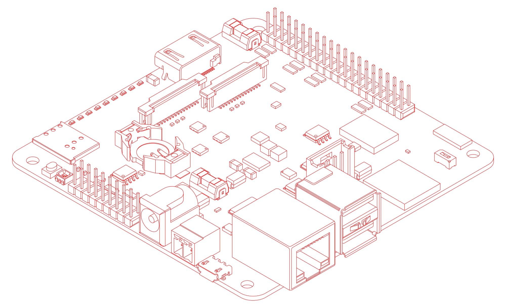

# balenaFin 1.0

## What is the balenaFin?

The balenaFin has been designed with field deployment in mind. It is a carrier board for the Raspberry Compute Module 3 and 3+ Lite (CM3L/CM3+L), that can run all the software that the Raspberry Pi can run, hardened for field deployment use cases.

#### Raspberry Pi Compute Module

The balenaFin supports the Raspberry Pi Compute Module 3 and 3+ lite (CM3L/CM3+L).

#### Storage

The storage on the balenaFin is based on an industrial grade eMMC storage with 8GB, 16GB, 32GB and 64GB options available.

#### Power

The balenaFin features a wide input voltage range (6V-24V), especially suitable for applications where a reliable 5V is usually not available.

#### Co-processor

The balenaFin includes a low-power co-processor (32-bit ARM® Cortex M4) with Bluetooth support. The co-processor can run on its own or in parallel and allows the main processor to be powered on and off programmatically. This is especially useful in applications where low power consumption or real-time processing is required.

#### Connectivity

The balenaFin's wireless chip supports 802.11ac/a/b/g/n WiFI and Bluetooth 4.2 (including SMART features).
There is a dual-band embedded antenna included in the board and an external antenna connector for improved signal coverage.

#### I/O

The Mini PCI Express port on the balenaFin brings seamless connectivity to a number of different modules. Third party modules are readily available for LTE, Zigbee, LoRA and CANBus and extra storage can be achieved by leveraging the USB interface on the mini PCI Express connector (this will probably require a custom design).
The balenaFin HAT header can be used to connect any Raspberry Pi HAT compatible module (PoE, RS232, ZWave, etc). A smaller 18-pin header exposes the co-processor's analog and time-sensitive I/O.
