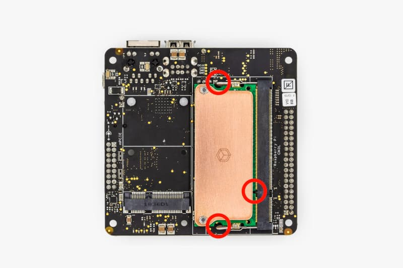

# Troubleshooting the balenaFin

## Troubleshooting

### My balenaFin is not listed as a writable device in balenaEtcher

The most probable cause is that you are using a low-quality or a power-only microUSB to USB cable. If possible, use the cable provided with the balenaFin Developer Kit.
If not using the Developer Kit cable, make sure you are using a high quality cable that has power and data capabilities.

### I cannot see any wireless interface listed, and WiFi doesn't work

Please make sure you have the balena-fin device tree overlay set in your `config.txt` file (`dtoverlay=balena-fin`).

### My WiFi signal is weak

There is a hardware switch on balenaFin that enables you to switch between the on-board and an external WiFi antenna - OFF for internal/on-board, ON for external.

### I have a HAT which works on a Raspberry Pi 3 but does not work on balenaFin, or my Raspberry Pi display or camera don't work

Please make sure you have the balenaFin dt-blob.bin in the root of the boot partition ([this](https://github.com/balena-io/balena-fin/raw/master/software/dt-blob/cam0_disp0/dt-blob.bin) in case of camera+display mode, [this](https://github.com/balena-io/balena-fin/raw/master/software/dt-blob/cam0_cam1/dt-blob.bin) in case of dual camera mode)

### My balenaFin is generating a lot of heat whilst running an application

If your application carries out intensive processing on the GPU, we highly recommend the use of the Raspberry Pi Compute Module 3+ Lite (CM3+L) over the older version, as it has much improved thermal performance. If you're using the Raspberry Pi Compute Module 3 Lite (CM3L/CM3+L) we suggest adding a heatsink to the system-on-chip on the CM3L/CM3+L. The heatsinks available for the Raspberry Pi 3 model B are compatible, depending on your device enclosure.

### My balenaFin does not appear in the balenaCloud dashboard

Check the list below for potential issues.

- Check that the balenaOS image flashed to the balenaFin has the correct SSID and password for your WLAN network
  - A pattern of 4-blinks on the ACT status LED indicates that the balenaFin cannot connect to a network
- Ensure that the WLAN radio physical switch (mapping 33) is set to the OFF position if you are **not** using an external antenna
- Verify that the power supply can maintain a minimum of 6 V (ideally 1.5 A or above) when powering the device from the Phoenix (mapping 23) or Barrel Adapters (mapping 24)
  - If USB1 ON and USB2 ON Status LEDs (mapping 18 & 23) are not turned ON, it is an indicator that the power supply may be insufficient for powering the balenaFin
  - The board may still power on if a low current or voltage is supplied, however the peripherals such as the Ethernet may not function correctly.

### My balenaFin does not appear in balenaEtcher

- Check the USB cable is suitable for both data and power transfer.
- The Raspberry Pi Compute Module should firmly click into the socket on the rear of the balenaFin. The metal latching mechanism should clip into the notches on the Compute Module. You will hear a distinct click when it fits into place.
- If running balenaEtcher on Linux, make sure you do so using `sudo` or as the root user.

