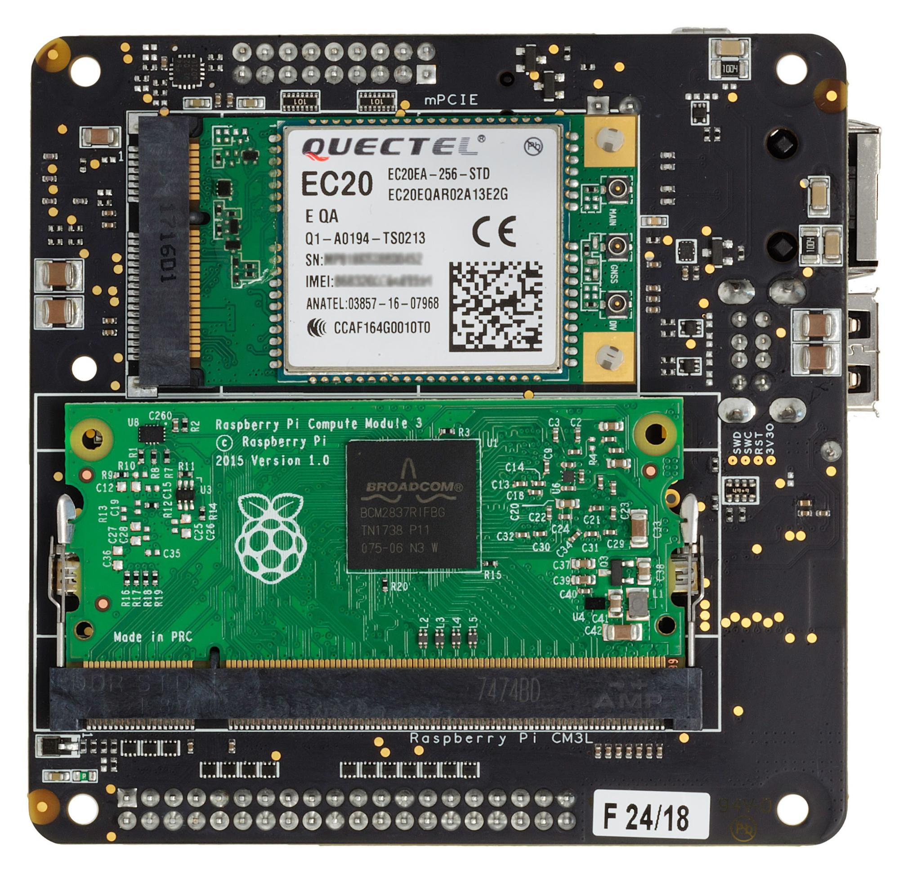

# Developer Instructions

## Installing specific Hardware support

#### Generic instructions for raspbian 2018-06-27 or later:

- Download the pre-build Raspbian (both lite and full available) for the balenaFin at [this link](./downloads/)

- Flash (we suggest using [etcher](https://balena.io/etcher/) 1.5.0+ ) and boot your device.

#### balenaOS / balenaCloud instructions:

- Download the [balenaFin (CM3) device type image](https://balena.io/os/#download) (2.29.2+rev7 or later) (on balenaCloud, create a balenaFin fleet first, than download balenaOS clicking "add Device")

- Flash (we suggest using [balenaEtcher](https://balena.io/etcher) ) and boot your device.

## Controlling Bluetooth and WiFi

From within balenaOS (HostOS), the `rfkill` command can be used to:

- List all wireless controllers

`rfkill list`

- Soft disable the Wireless LAN (WiFi)

`rfkill block wifi`

- Soft disable the Bluetooth

`rfkill block bluetooth`

Note, these commands **DO NOT** disable the physical hardware.
It is only possible to disable the radio interfaces with software.

## Programming the co-processor on balenaFin

The co-processor `SWDIO` interface is exposed to the compute module via bit-banged `GPIO` pins.
The co-processor can be flashed from the compute module.

We provide a [balenaBlock](https://www.balena.io/blog/introducing-balenablocks-jumpstart-your-iot-app-development/) for flashing the co-processor, the [fin-block](https://github.com/balenablocks/fin).
The functionality for flashing the co-processor will be broken out into a standalone NodeJS package (in development).

## Using the RTC from CM3L/CM3+L

The balenaFin sports a very common I2C RTC module that is well known, supported, and documented within the Raspberry Pi ecosystem: the **DS1307.**

There are plenty of guides on how to interact with the chip, including the following:

- [https://learn.adafruit.com/adding-a-real-time-clock-to-raspberry-pi/set-rtc-time](https://learn.adafruit.com/adding-a-real-time-clock-to-raspberry-pi/set-rtc-time)
- [https://thepihut.com/blogs/raspberry-pi-tutorials/17209332-adding-a-real-time-clock-to-your-raspberry-pi](https://thepihut.com/blogs/raspberry-pi-tutorials/17209332-adding-a-real-time-clock-to-your-raspberry-pi)

## Controlling the RGB LED

balenaFin v1.1 sports a PCA9633 LED controller. This controller is mainline supported and enumerates the 3 color LEDs as sysfs led class devices in `/sys/class/leds/pca963x:$COLOR` where `$COLOR` can be `blue`, `red` or `green`. This interface allows to set each color brightness or register a [kernel trigger](https://www.kernel.org/doc/Documentation/leds/leds-class.txt) to each color.

- Setting a color brightness: `echo $BRIGHTNESS > /sys/class/leds/pca963x\:$COLOR/brightness` where `$BRIGHTNESS` is a value between 0 (off) and 255 (100%) and `$COLOR` can be `blue`, `red` or `green`
- Registering a trigger to a color: `echo $TRIGGER > /sys/class/leds/pca963x\:$COLOR/trigger` where `$TRIGGER` is a supported [kernel trigger](https://www.kernel.org/doc/Documentation/leds/leds-class.txt) (like `mmc0` that will make the LED behave the same as the green ACT led of the Raspberry Pi) and `$COLOR` can be `blue`, `red` or `green`

## Dual camera mode

- Replace the `dt-blob.bin` file in the boot partition of the board with [this file](https://github.com/balena-io/balena-fin/blob/master/software/dt-blob/cam0_cam1/dt-blob.bin). You can use etcher for mounting the balenaFin boot partition attached via the PRG cable (and no PSU attached!) or you can edit the OS image before flashing it onto the balenaFin.
- Power off the balenaFin and unplug it from the PSU
- Switch the DIP switch located on the bottom of the board, behind the Compute module (marked as #37 in the datasheet mapping section) to the `CAM1` position. **This operation needs to be performed with the device powered OFF!**
- Boot your device, you now have both `cam0` and `cam1` interfaces available.

## Toggling the Status LED bank

This device sports 9 status LEDs varying from power, eMMC, ethernet, WiFi, WAN, etc. There is a switch which allows users to toggle them all on and off via software.

- `exp_base=$(cat /sys/devices/platform/i2c*/i2c-*/*-0020/gpio/*/base)`
- `led_gpio=$(expr $exp_base + 7)`
- `echo ${led_gpio} > /sys/class/gpio/export`
- `echo "out" > /sys/class/gpio/gpio${led_gpio}/direction`
- `echo 0 > /sys/class/gpio/gpio${led_gpio}/value # turn off`
- `echo 1 > /sys/class/gpio/gpio${led_gpio}/value # turn on`

## Cellular via mPCIe card

We are working on identifying and documenting cards known to work out of the box on the board. If you plan on adding LTE capability to the device, we suggest the Quectel EC21-XX Mini PCIe: the card is known to work out of the box, hence only APN configuration is required. On balenaOS (2.0.0+) you do so by adding a NetworkManager profile in the boot partition under the "system-connections" folder. You can find more info about this on our docs at: [https://balena.io/docs/deployment/network/2.0.0/#cellular-modem-setup](https://balena.io/docs/deployment/network/2.0.0/#cellular-modem-setup).

Reset mPCIe radio cards

- `exp_base=$(cat /sys/devices/platform/i2c*/i2c-*/*-0020/gpio/*/base)`
- `mpcie_perst_gpio=$(expr $exp_base + 5)`
- `echo ${mpcie_perst_gpio} > /sys/class/gpio/export`
- `echo "out" > /sys/class/gpio/gpio${mpcie_perst_gpio}/direction`
- `echo 1 > /sys/class/gpio/gpio${mpcie_perst_gpio}/value # mPCIe PERST on`
- `echo 0 > /sys/class/gpio/gpio${mpcie_perst_gpio}/value # mPCIe PERST off`

Disabling RF activity on mPCIe radio cards

- `exp_base=$(cat /sys/devices/platform/i2c*/i2c-*/*-0020/gpio/*/base)`
- `radio_gpio=$(expr $exp_base + 4)`
- `echo ${radio_gpio} > /sys/class/gpio/export`
- `echo "out" > /sys/class/gpio/gpio${radio_gpio}/direction`
- `echo 1 > /sys/class/gpio/gpio${radio_gpio}/value # mPCIe W-DISABLE on`
- `echo 0 > /sys/class/gpio/gpio${radio_gpio}/value # mPCIe W-DISABLE off`

Disabling HDMI

- `exp_base=$(cat /sys/devices/platform/i2c*/i2c-*/*-0020/gpio/*/base)`
- `hdmi_gpio=$(expr $exp_base + 3)`
- `echo ${hdmi_gpio} > /sys/class/gpio/export`
- `echo "out" > /sys/class/gpio/gpio${hdmi_gpio}/direction`
- `echo 1 > /sys/class/gpio/gpio${hdmi_gpio}/value # HDMI off`
- `echo 0 > /sys/class/gpio/gpio${hdmi_gpio}/value # HDMI on`

## Power saving

- Turn off HDMI when not required
- Turn off the STATUS LEDs bank
- Programmatically disable RF activity on mPCIe when not required (assumes a cellular modem is being used)
- Programmatically power on and off the CM3L/CM3+L when not required via the co-processor PIN PC9 (5V interface) and PIN PF5 (3.3V interface). This is the equivalent of unplugging power from the Raspberry Pi
